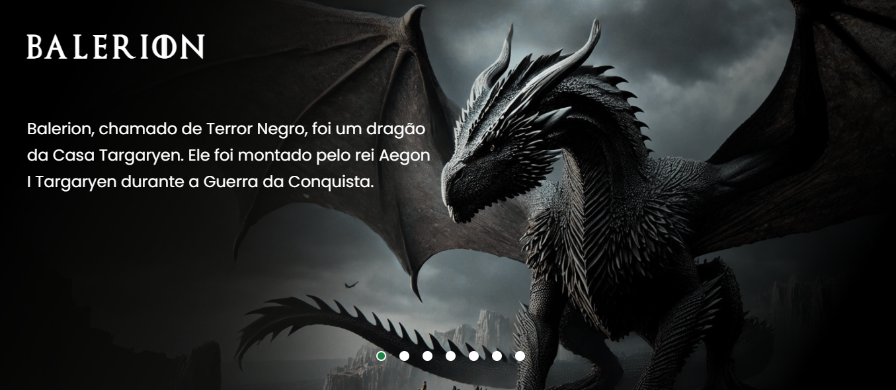

# 🐉 Projeto House of The Dragon

Bem-vindo ao repositório do **Projeto House of The Dragon**! 

## 📜 Sobre o Projeto

O **Projeto House of The Dragon** é uma aplicação web simples que exibe um carrossel de imagens com os nomes e informações dos dragões da série *House of The Dragon* (no Brasil: *A Casa do Dragão*). Esta série de televisão de drama e fantasia medieval norte-americana conquistou fãs ao redor do mundo.
O principal objetivo deste projeto é praticar programação utilizando as tecnologias HTML, CSS e JavaScript. 

Este projeto foi desenvolvido durante um evento online conduzido pelos gêmeos Ricardo e Roberto Dias, conhecidos como [Dev em Dobro](https://www.instagram.com/devemdobro/).

## 🚀 Tecnologias Utilizadas

- **HTML** - Estrutura básica da aplicação.
- **CSS** - Estilização e design do carrossel e das informações.
- **JavaScript** - Funcionalidade dinâmica do carrossel de imagens.

## 📸 Demonstração

Aqui você pode visualizar a prévia do carrossel:


<p align="center">
    
</p>

## 📂 Como Executar o Projeto

1. Clone o repositório:

   ```bash
   git clone https://github.com/seu-usuario/nome-do-repositorio.git

2. Navegue até o diretório do projeto:
   ```bash
   cd nome-do-repositorio

3. Abra o arquivo index.html no seu navegador para visualizar o projeto.
